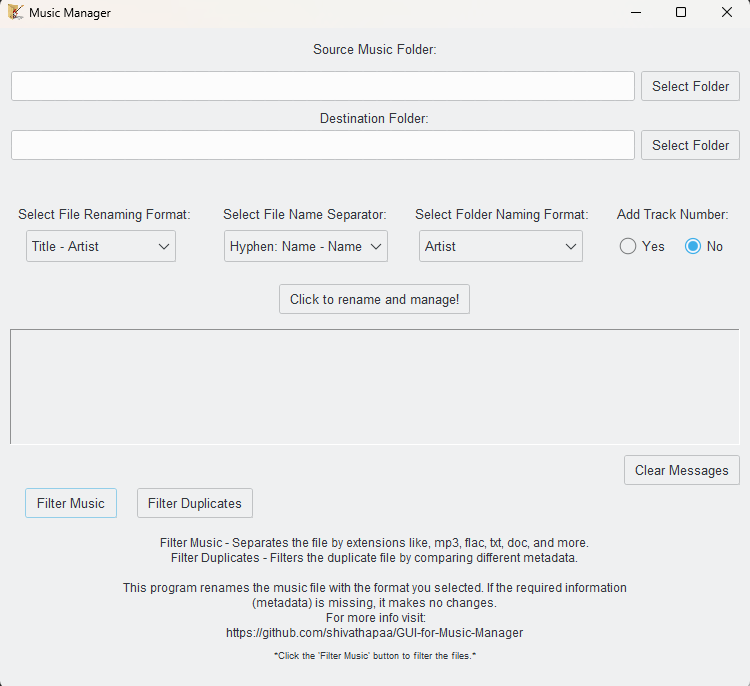
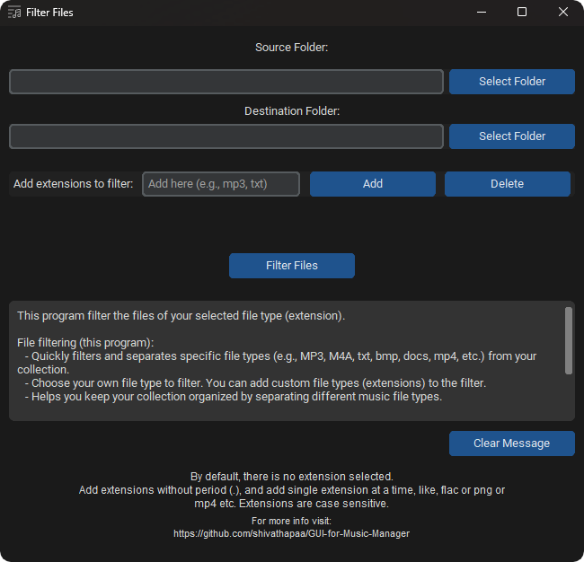

# GUI for Music Manager

## Overview

The Music Collection Manager is a Python-based desktop application that allows you to manage and organize your music collection. It provides a user-friendly interface for renaming music files, filtering files based on extensions, finding duplicates, and moving them to a different folder.

This application consists of three main components:

1. **Music Management:**
   - Organize your music files by renaming them based on their tags. 
   - Handles various music file formats, including MP3, FLAC, WAV, and many more.
   - Offers quite a variety of file name formats to choose from:
     - Title
     - Title - Artist (e.g. Blinding Lights  - The Weeknd)
     - Title - Album (e.g. Blinding Lights  - After Hours)
     - Artist - Title
     - Title - Album Artist
   - Has options to choose a file name separator for separating tags:
     - Hyphen  --  "Name - Name" (e.g. Blinding Lights  - The Weeknd)
     - Small brackets  --  "Name (Name)" (e.g. Blinding Lights (The Weeknd))
   - Lets you to choose the destination folder names in different formats:
     - Artist (e.g. The Weeknd)
     - Album (e.g. After Hours)
     - Album Artist
   - You can choose to keep the *Track Number* when renaming the file.
   - You can keep track of files with the help of a feedback box (displays counter and details).
   - User-friendly GUI with options to select source and destination folders along with other different options as described above.

2. **File Filtering:**
   - Quickly filter and separate specific file types (e.g., MP3, M4A, txt, bmp, docs, mp4, etc.) from your collection.
   - Choose your own file type to filter. You can add custom file types to the filter.
   - Helps you keep your collection organized by separating different music file types.
   - Here too, you will get a feedback box to make it easier to track your files.
   - User-friendly GUI with an option to add your own custom extension.

3. **Filter Duplicates:**
- Filters music files by selecting different comparison options. It mainly uses the metadata of the file rather than the filename. You get to choose from the following options:
  - Title
  - Artist
  - Album
  - Album Artist
  - Title and Artist
  - Title and Album
  - Title and Album Artist
- This script can handle a wide range of music file types, ensuring compatibility with popular formats like .mp3, .flac, .wav, .aif, .m4a, and more.
- The script provides detailed feedback and error messages, keeping you informed about the progress of the filtering process.
- User-friendly GUI making it accessible to users of all experience levels.

  > **Note:** *Think Twice before choosing a single tag option for this filter operation.*

  This does not check for the file extensions while comparing, so I recommend first to filter files using the program ***File Filtering*** (inside the main GUI) option if necessary.

## Features

- Easy-to-use GUI for managing music collection.
- Organize music in a variety of formats as you like.
- Filter files for specific file formats (not just limited to music files).
- Filter duplicate files while comparing metadata (more accurate and reliable result).
- Feedback box where you can keep track of all the operations being performed by the program. It gives you a proper feedback message where you can easily monitor the changes.

## Getting Started

1. **Download:**
   - Download the latest release from the [Releases](https://github.com/shivathapaa/GUI-for-Music-Manager/releases) section.
   - Extract the downloaded archive to your preferred location on your computer.

2. **Running the Application:**
   - Locate and run the application (e.g., `musicManager.exe`) inside the extracted folder.

3. **Using the Music Collection Manager:**
   - Select the source and destination folders for your music collection.
   - Choose variety of format options for ([refer above](#gui-for-music-Manager)):
     - File Naming
     - Tag Separating
     - Dest. Folder Naming
     - Including Track Number
   - Click "Click to rename and manage!" to organize your music collection.

4. **Using the File Filtering Feature:**
   - Select the source and destination folders for your music collection.
   - Add any file type extensions that you want to separate.
   - You can also delete the file type extensions that you have added without the need for closing the application.
   - Click "Filter Music" to separate specific music file formats (e.g., MP3, M4A, txt, bmp, docs, etc.) from your collection.

5. **Using the Filtering Duplicates Feature:**
   - Select the source and destination folders for your music collection.
   - Choose a variety of format options for metadata comparison. ([refer above](#gui-for-music-Manager))
   - Click "Filter Duplicates" to filter the duplicate files.

## Dependencies

- No external Python dependencies are required when using the built executable.

## Screenshots

- Don't judge by the looks!😉

  
  
  

## License

This project is licensed under the GNU License - see the [LICENSE](LICENSE) file for details.

## Acknowledgments

- Special thanks to [TinyTag](https://pypi.org/project/tinytag/) and [cx-Freeze](https://pypi.org/project/cx-Freeze/) for their library.

## Usage Instructions/Notes

- This application has been tested with extreme cases to extend, for checking its reliability.
- It has been tested with thousands of similar and dissimilar music files. (Gives 100% accuracy. No doubt!)
  > In spite of the best performance, I still recommend you to ensure that you have a backup copy of your music files before using the application. You should be responsible for your own files.
- If you notice any problem, please raise an [issue](https://github.com/shivathapaa/GUI-for-Music-Manager/issues).

## Future Updates

- I am open to suggestions.

 

I hope it will be helpful! Enjoy your music!

---
